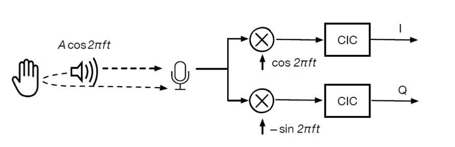
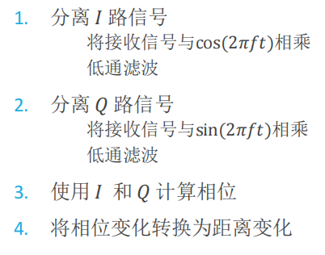

# SWproject
Phase-based distance tracking

此文件夹包含以下文件：
```
树莓派：
    query_device.py 列出树莓派上所有的音频设备接口，后面编程时需要
    play.py 用于播放18000L(左声道18000Hz))音频文件
    18000L.wav 音频文件，采样频率48kHz，左声道声波频率18kHz，右声道静音
    getdis.py 用于实时录音并将分析音频所得的距离做是否有人的判断，目前的逻辑是设备前无人时启动，有人终端返回1和相对距离，流水灯闪烁一定时间，无人返回0，灯灭。
```

- [SWproject](#swproject)
  - [Environment](#environment)
  - [Usage](#usage)
  - [Principle](#principle)
  - [Difficulties and Solutions](#difficulties-and-solutions)


## Environment
Hardware
* PC's, Desktop, Laptops
* Raspberry Pi 4B
* ReSpeaker 6-Mic(sampling rate is at least 48000)
* Speaker（emit at least 20000Hz sound waves）
  
OS
* Windows 7, 8, 10，11
* Linux on PC - Tested on several distributions
* Raspberry Pi OS
  
SWprject  has the following dependencies:
* Python 3
* [pyaudio](https://people.csail.mit.edu/hubert/pyaudio/)
* [scipy](https://scipy.org/)
* [pixel_ring](https://wiki.seeedstudio.com/cn/ReSpeaker_6-Mic_Circular_Array_kit_for_Raspberry_Pi/)
* [NumPy](https://pypi.org/project/numpy/)


## Usage

0 在树莓派上安装所需的依赖；运行query_device.py，列出树莓派上所有的音频设备接口，修改play.py中的utput_device_index和getdis.py中的input_device_index。

1 在树莓派终端中依次运行 play.py 和 getdis.py。

## Principle 
Phase-based distance tracking
Refer to Device-Free Gesture Tracking Using Acoustic Signals.pdf




## Difficulties and Solutions
||Difficulties|Solutions|
|-------|-------------|----------|
|识别距离|测距范围非常可惜|换一套好的播收音设备|
|处理速度|计算距离算法效率上需要改良|累计距离后剪裁需要处理的数据、换个处理器|
|实时性|判断是否有人的实时性和led闪灭的实时性|剪裁数据、改良算法、改用C实现|
|内存占用|产生了较多的垃圾数据|数据量达到一定阈值后裁剪，计算的距离从上次累计结果的开始累加|
|有效时间|有效时间较短|改善处理速度、实时性、内存占用问题后有效时间就能显著提高了。目前主要是由于每次都是从头计算整个音频数据，所以音频的数据量较多时计算量对于树莓派太大，需要改良计算距离的算法或者剪裁数据|

